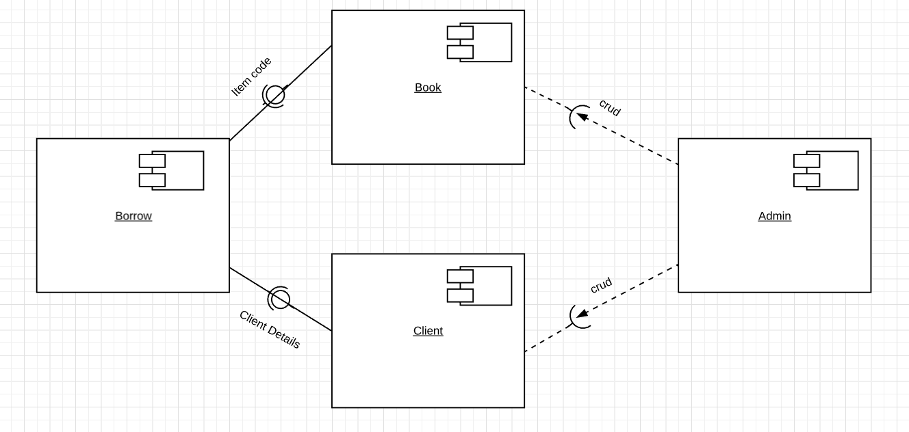
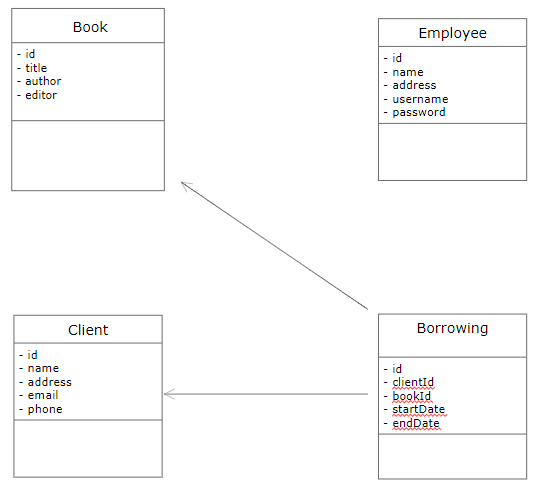

# Library Management Specification
Acest proiect are ca scop o alta abordare a organizarii unei librarii.
Dispune de un admin si de o lista de angajati si clienti care au drepturi de a realiza diferite operatii.
Adminul poate face operatiile de CRUD pe angajati, iar angajatii pot face aceleasi operatii pe clienti.
Scopul acestui proiect este de a realiza o organizare mai buna a imprumuturilor cartilor unei librarii. Astfel, un clinet poate sa isi rezerve o carte intr-un anumit interval, in functie de disponibilitatea acesteia.
Clientul, in momentul in care se apropie termenul de predare, va fi instiintat printr-un email.

# Elaboration – Iteration 1.1

## Domain Model
[Define the domain model and create the conceptual class diagrams]

## Architectural Design

### Conceptual Architecture
Sablonul arhitectural folosit este MVC. Acesta ajuta la izolarea partii logice de interfata proiectului.
Model-ul contine informatiile necesare aplicatiei.
View-ul contine elementele de interfata si se ocupa cu afisarea datelor.
Controller-ul contine comunicarea si deciziile proceselor. Face legatura intre model si view.

### Package Design

### Component and Deployment Diagrams

####Component Diagram

# Elaboration – Iteration 1.2

## Design Model

### Dynamic Behavior
[Create the interaction diagrams (1 sequence, 1 communication diagrams) for 2 relevant scenarios]

### Class Design
[Create the UML class diagram; apply GoF patterns and motivate your choice]

### Data Model
[Create the data model for the system.]

### Unit Testing
[Present the used testing methods and the associated test case scenarios.]

# Elaboration – Iteration 2

## Architectural Design Refinement
[Refine the architectural design: conceptual architecture, package design (consider package design principles), component and deployment diagrams. Motivate the changes that have been made.]

## Design Model Refinement
[Refine the UML class diagram by applying class design principles and GRASP; motivate your choices. Deliver the updated class diagrams.]

# Construction and Transition

## System Testing
[Describe how you applied integration testing and present the associated test case scenarios.]

## Future improvements
[Present future improvements for the system]

# Bibliography
- [Architectural Styles](https://docs.microsoft.com/en-us/azure/architecture/guide/architecture-styles/)
- [Architectural Patterns and Styles](https://msdn.microsoft.com/en-us/library/ee658117.aspx)
- [Online diagram drawing software](https://yuml.me/) ([Samples](https://yuml.me/diagram/scruffy/class/samples))
- [Yet another online diagram drawing software](https://www.draw.io)
